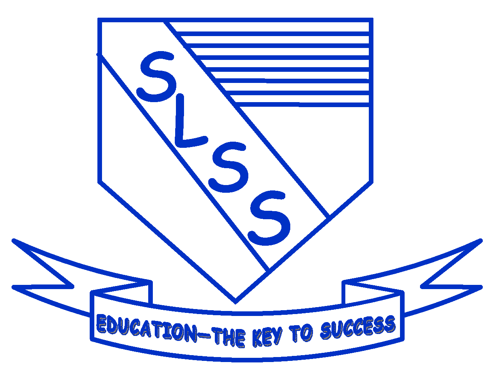

# Success Laventille Secondary School - Student Management System

A modern, secure, and user-friendly Laravel 11 student management system for Success Laventille Secondary School, featuring comprehensive student record management, advanced PDF generation, and CSV import capabilities.



## 🌟 Features

### Core Functionality
- **Complete Student Record Management** - Store and manage comprehensive student information including:
  - Personal details (name, DOB, gender, contact info)
  - SEA examination records
  - Medical information and allergies
  - Parent/Guardian contact details
  - Emergency contact information
  - Registrant information

### Advanced Features
- **🖨️ Professional PDF Generation** - Generate beautifully formatted student profile PDFs with watermarks
- **📊 Bulk PDF Export** - Export multiple student profiles to a single PDF document
- **🔍 Advanced Filtering** - Filter students by year, class, and name
- **📁 CSV Import** - Bulk import student records from CSV files
- **📸 Photo Management** - Upload and manage student passport photos
- **🔐 Role-Based Access Control** - Three user roles (Admin, Staff, Viewer)
- **📱 Responsive Design** - Works seamlessly on desktop, tablet, and mobile devices
- **🎨 Modern UI** - Clean, intuitive interface with Bootstrap 5

### Security Features
- Laravel authentication and authorization
- CSRF protection
- Secure file uploads
- Password hashing
- SQL injection prevention

## 📋 Requirements

- **PHP >= 8.2** (8.3 recommended for optimal compatibility)
- Composer
- MySQL >= 5.7 or MariaDB >= 10.3
- Node.js & NPM (for asset compilation, optional)
- Extensions: PDO, Mbstring, OpenSSL, Tokenizer, XML, Ctype, JSON, BCMath, GD

**Note:** If using PHP 8.2, you may need to run `composer update` after installation to regenerate the lock file.

## 🚀 Deployment Options

### Hostinger Web Hosting (Production)

**For Hostinger deployment, see:** [HOSTINGER_DEPLOYMENT.md](HOSTINGER_DEPLOYMENT.md)

Complete step-by-step guide for deploying to Hostinger shared hosting with:
- Pre-configured for your Hostinger account
- Database setup instructions
- Document root configuration
- Troubleshooting guide
- Security checklist

### Local Development Installation

#### Prerequisites

Ensure you have:
- PHP 8.2 or higher (8.3 recommended)
- Composer
- MySQL or MariaDB
- Web server (Apache/Nginx) or PHP's built-in server

### Installation Steps

```bash
# 1. Navigate to project directory
cd slss-laravel

# 2. Install dependencies
composer install

# 3. Setup environment
cp .env.example .env
php artisan key:generate

# 4. Configure database in .env
# Edit these values:
# DB_DATABASE=slss_student_portal
# DB_USERNAME=root
# DB_PASSWORD=your_password

# 5. Create database
mysql -u root -p -e "CREATE DATABASE slss_student_portal CHARACTER SET utf8mb4 COLLATE utf8mb4_unicode_ci;"

# 6. Run migrations and seeders
php artisan migrate
php artisan db:seed
php artisan storage:link

# 7. Set permissions
chmod -R 775 storage bootstrap/cache

# 8. Start development server
php artisan serve
```

**Access:** http://localhost:8000

### Troubleshooting Installation

**"composer: command not found"**
```bash
php -r "copy('https://getcomposer.org/installer', 'composer-setup.php');"
php composer-setup.php --install-dir=/usr/local/bin --filename=composer
```

**"Connection refused"** - MySQL not running:
```bash
# Ubuntu/Debian: sudo service mysql start
# macOS: brew services start mysql
```

**"Permission denied"**
```bash
chmod -R 775 storage bootstrap/cache
```

**"Class not found"**
```bash
composer install
```

## 👤 Default Login Credentials

After running the seeders, you can login with:

### Administrator
- **Email:** admin@slss.edu.tt
- **Password:** admin123
- **Permissions:** Full access (create, edit, delete, import)

### Staff
- **Email:** staff@slss.edu.tt
- **Password:** staff123
- **Permissions:** Create, edit, import

### Viewer
- **Email:** viewer@slss.edu.tt
- **Password:** viewer123
- **Permissions:** View only

**⚠️ IMPORTANT:** Change these passwords immediately after first login!

## 📖 Usage Guide

### Managing Students

#### Viewing Students
1. Login to the system
2. Navigate to "Students" from the main menu
3. Use filters to narrow down results by:
   - Registration Year
   - Form Class (1A-1F)
   - Student Name

#### Adding a New Student
1. Click "Add New Student" button (Admin/Staff only)
2. Fill in the student information form
3. Upload passport photo (optional)
4. Click "Save Changes"

#### Editing Student Records
1. Find the student in the list
2. Click the "Edit" button (pencil icon)
3. Update the information
4. Click "Save Changes"

### Generating PDFs

#### Single Student Profile
1. Find the student in the list
2. Click the "Generate PDF" button (green PDF icon)
3. PDF will download automatically

#### Bulk PDF Export
1. Apply filters to select specific students (or leave filters empty for all)
2. Click "Bulk PDF" button
3. All filtered students will be exported to one PDF

### Printing Profiles

#### Print All (Browser Print)
1. Apply filters if needed
2. Click "Print All" button
3. Use browser print dialog to print or save as PDF

### Importing Students from CSV

1. Login as Admin or Staff
2. Navigate to "Import" from the menu
3. Click "Choose File" and select your CSV file
4. Click "Upload and Import"
5. Review the import results

**CSV Format Requirements:**
- Must include header row with column names
- Column names must match the database field names
- Duplicate students (by Birth Certificate PIN) will be skipped
- Date fields should be in format: MM/DD/YYYY or YYYY-MM-DD

**Sample CSV columns:**
```
student_name,form_1_class,student_gender,student_dob,student_birth_certficate_pin,mother_name,father_name,...
```

## 🗂️ Project Structure & Architecture

### Directory Structure

```
slss-laravel/
├── app/
│   ├── Http/
│   │   ├── Controllers/          # Thin controllers (delegate to services)
│   │   │   ├── StudentController.php    # Student CRUD + PDF
│   │   │   ├── ImportController.php     # CSV import
│   │   │   └── AuthController.php       # Authentication
│   │   ├── Requests/             # Form validation classes
│   │   │   ├── StoreStudentRequest.php
│   │   │   └── UpdateStudentRequest.php
│   │   └── Middleware/
│   ├── Models/
│   │   ├── Student.php           # Eloquent model with scopes
│   │   └── User.php              # User authentication
│   ├── Services/                 # Business logic layer
│   │   ├── StudentService.php    # Student operations
│   │   ├── PdfService.php        # PDF generation
│   │   └── CsvImportService.php  # CSV processing
│   └── Providers/
│       └── AuthServiceProvider.php      # Authorization gates
├── database/
│   ├── migrations/               # Database schema
│   └── seeders/                  # Data seeders
├── resources/views/              # Blade templates
├── routes/web.php                # Application routes
├── public/                       # Web root
└── config/                       # Configuration files
```

### Architecture Pattern: Service Layer

The application follows **service-oriented architecture**:

- **Controllers** - Handle HTTP requests, delegate to services
- **Services** - Contain business logic, reusable across controllers
- **Form Requests** - Validate input data
- **Models** - Database interaction via Eloquent ORM

**Benefits:**
- Clean separation of concerns
- Easier testing and maintenance
- Reusable business logic
- Follows SOLID principles

## 🎨 Customization

### Changing School Branding

1. Replace logo: `public/images/successlogo.png`
2. Replace watermark: `public/images/OfficialDocument1.png`
3. Update school name in views:
   - `resources/views/layouts/app.blade.php`
   - `resources/views/students/pdf.blade.php`

### Modifying Form Classes

Edit the classes array in:
- `resources/views/students/index.blade.php`
- `resources/views/students/edit.blade.php`

### Customizing PDF Layout

Edit: `resources/views/students/pdf.blade.php`

## 🔧 Troubleshooting

### Common Issues

| Issue | Solution |
|-------|----------|
| "SQLSTATE[HY000] [1045] Access denied" | Check database credentials in `.env` |
| "No application encryption key" | Run `php artisan key:generate` |
| "Stream or file could not be opened" | Run `chmod -R 775 storage bootstrap/cache` |
| "Class not found" | Run `composer install` |
| PDF images not showing | Run `php artisan storage:link` |
| CSV import fails | Check `storage/` permissions, verify UTF-8 encoding |
| 500 Error | Check `storage/logs/laravel.log` |

### Debug Commands

```bash
# Clear all caches
php artisan cache:clear
php artisan config:clear
php artisan view:clear

# Check logs
tail -f storage/logs/laravel.log

# Verify environment
php artisan about
```

## 🔐 Security Best Practices

1. **Change default passwords immediately**
2. **Set strong APP_KEY** - Run `php artisan key:generate`
3. **Use HTTPS** in production
4. **Keep dependencies updated** - Run `composer update` regularly
5. **Backup database** regularly
6. **Restrict file upload types** - Only allow images for passport photos
7. **Set proper file permissions** - Never use 777
8. **Use environment variables** - Never commit `.env` to version control

## 📊 Database Backup

### Backup
```bash
php artisan db:backup  # If backup package installed
# OR manually:
mysqldump -u username -p slss_student_portal > backup_$(date +%Y%m%d).sql
```

### Restore
```bash
mysql -u username -p slss_student_portal < backup_20250106.sql
```

## 🆕 Migrating from Old System

### Method 1: Import from SQL Dump (Recommended for bulk data)

If you have an existing `slss.sql` database dump:

```bash
# Option A: Use the automated seeder
php artisan db:seed --class=ImportFromSqlDumpSeeder

# Option B: Direct MySQL import
mysql -u root -p slss_student_portal < /path/to/slss.sql
```

### Method 2: CSV Import (Recommended for new data)

1. Login to the system as Admin or Staff
2. Navigate to "Import" from the menu
3. Upload your CSV file
4. Review import results

**CSV Format:**
- Must include header row with column names
- Date fields: MM/DD/YYYY or YYYY-MM-DD
- Duplicates (by Birth Certificate PIN) will be skipped

### Method 3: Copy Student Photos

```bash
# Copy existing photos to new system
cp -r /old-system/uploads/* /new-system/public/uploads/
```

## 📝 License

This project is proprietary software developed for Success Laventille Secondary School.

## 👨‍💻 Support

For technical support or feature requests, please contact the system administrator.

## 🙏 Acknowledgments

- Built with [Laravel 11](https://laravel.com/)
- PDF generation by [DomPDF](https://github.com/barryvdh/laravel-dompdf)
- UI components by [Bootstrap 5](https://getbootstrap.com/)
- Icons by [Font Awesome](https://fontawesome.com/)

---

**Version:** 2.0.0
**Framework:** Laravel 11
**Last Updated:** January 2025
**Developed for:** Success Laventille Secondary School, Trinidad and Tobago
